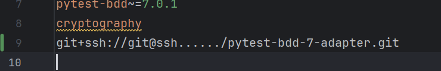
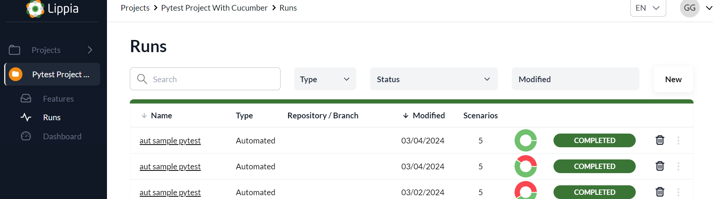
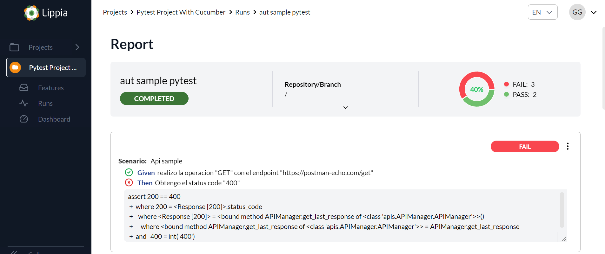

# Pytest Sample Project  

# Purpose

This project includes testing scenarios implemented using the Pytest BDD framework. Pytest BDD is a behavior-driven testing framework that allows you to write tests in Gherkin syntax and run them using the PyTest runner.
  
## Requirements  
  
 - [Python 3.8.10 installed](https://www.python.org/)  
 - PyTest framework installed (version 7.4.0)  
  
## Setup  
This repository contains automated tests implemented using the PyTest framework. The tests aim to validate the functionality and ensure the quality of the software application.  
  
  
### Clone the repository:  
  
```bash  
git clone ```  
  
  
### Create and activate a virtual environment (optional but recommended):  
  
```bash  
python -m venv venv.\venv\Scripts\activate ```  
  
### Install the project dependencies(Before downloading the dependencies, add the path to install the Lippia Test Manager Reporter from git.):  
  
```bash  
pip install -r requirements.txt```  
  
### Running Tests  
To execute the automated tests, use the following command:  
  
```bash  
pytest  
```  
  
###  Reports integrations
PyTest generates detailed reports after running tests, including information about passed, failed, and skipped tests. These reports are saved in the reports directory.  
  
 - **Lippia Test Manager** a solution that combines manual and automated test results in a single platform. For more information, go to [Lippia.io](https://lippia.io)
 - **PytestReport** a community solution for simple reports

### Lippia Test Manager
This integration uses an adaptar that automatically ingests results of Scenarios into Lippia Test Manager. You just simply need to implement [pytest-bdd-7-adapter](https://gitlab.crowdaronline.com/lippia/products/test-manager/adapters/pytest-bdd-7-adapter) and you can see the results in Lippia Test Manager as an Automated Run Result.

### **Settings**

In order to utilize the LTM reporting library, you first need to set the environment variables with the values for **LTM-User, LTM-Pass, LTM-HostKey, LTM-RepositoryUrl and LTM-RepositoryBranch**. 
Next, you'll need to add the git line to download the dependency in the requirements file with **"git+ssh://git@ssh....../pytest-bdd-7-adapter.git"**. 
Lastly, set the values for the **Project code** and **Run name** variables in the config.py file.


The implementation of the **Lippia Test Manager reporter** requires the use of hooks by implementing the **TestManagerAPIAdapter** class in the **conftest.py** file





 - **Project code:** A unique identifier for the project.

    
-   **Run name:** A descriptive name for the test run.

When running the tests, the hooks in the conftest file will automatically execute, injecting the generated report into LTM. 

  
  

### **Folder's description:**
|Folder's|Description  |
|--|--|
|*.feature  |Folder with all the feature files containing Test Scenarios  |
|requirements.txt|Contains text files (`*.txt`) specifying the project's dependencies - the libraries and Python versions required to run the code correctly.|
|config.py|The `config.py` file contains configuration variables for the project, specifically for integration with LTM (Lippia Test Manager). |
|conftest.py|The `conftest.py` file contains specific configurations and hooks for integration with LTM (Lippia Test Manager) in an automated testing project using Pytest and Pytest BDD.|
|test_api_steps.py|The `test_api_steps.py` file contains step definitions for tests written in BDD (Behavior-Driven Development) style using Pytest BDD. These steps are used to execute API tests using the `requests` library for making HTTP requests and `pytest_bdd` for structuring tests into scenarios.|

**To execute the scenarios in the following ways:**

 1. Run all scenarios from the same feature:

>       scenarios('api.feature')

 3. Execute specific scenarios:

>    @scenario('api.feature', 'Scenario Example')
     @scenario('api.feature', 'Scenario Example2')

